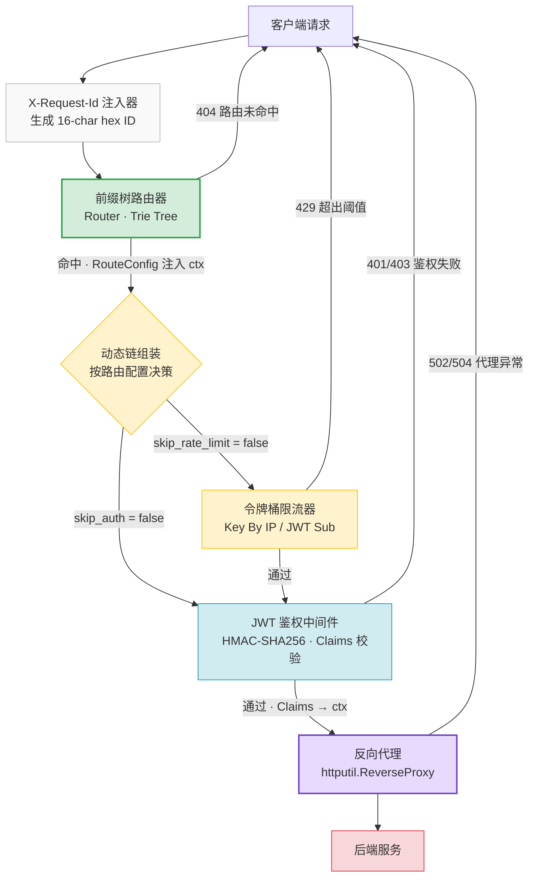

<picture>
  
  
  
  
  
</picture>

# Mini Gateway

> **基于 Go 标准库从零手写的轻量级高并发 API 网关 — 拒绝框架黑盒，每一行代码都可控。**

一个面向国内互联网业务场景的迷你 API 网关。反向代理、JWT 鉴权、令牌桶限流、前缀树路由 —— 全部基于 `net/http` 和 `net/http/httputil` 原生实现。不依赖 Gin、Echo、Fiber 等任何第三方 Web 框架。架构清晰，源码可读，适合深入理解网关底层原理，也可直接嵌入中小型项目作为内部网关使用。

---

##  核心特性

###  零依赖 · 纯原生引擎

核心链路完全基于 Go 标准库构建。反向代理封装自 `net/http/httputil.ReverseProxy`，通过自定义 `Director` 函数实现后端寻址、路径重写、请求头注入。整个项目仅引入三个必要的外部库：

| 依赖 | 用途 |
|------|------|
| `github.com/golang-jwt/jwt/v5` | JWT 令牌解析与签名验证 |
| `golang.org/x/time/rate` | 令牌桶基础数据结构 |
| `gopkg.in/yaml.v3` | YAML 配置文件解析 |

没有 ORM、没有 Web 框架、没有自动魔法 —— **每一行堆栈都清晰可追溯。**

### ⚡ 高性能路由 · 前缀树匹配

路由器采用 **两层索引结构**：

- **精确匹配** — `map["METHOD:PATH"]` 实现 O(1) 查找
- **前缀匹配** — 按前缀长度降序排列的切片，**长前缀优先命中**

匹配到的 `RouteConfig` 直接注入 `context.Context`，下游中间件无需二次查找即可读取路由级策略（是否跳过鉴权、自定义限流阈值、超时时间），全程零内存分配额外开销。

```
/api/v1/users/profile  →  /api/v1/users/  (长前缀命中，非 /api/)
/api/v1/users           →  exact match     (精确优先于前缀)
/api/v1/users-admin     →  不匹配误伤       (CutPrefix + "/" 边界检查)
```

###  企业级限流 · 令牌桶

纯手写并发安全令牌桶限流器，核心设计亮点：

- **懒创建 (Lazy Creation):** 每个限流 Key（IP 地址或 JWT `sub`）的 `rate.Limiter` 仅在首次请求时创建，不为海量客户端预分配内存。
- **自动 GC (Auto Cleanup):** 后台 Goroutine 定时扫描限流器 Map，将 `lastSeen` 超过 TTL 的条目回收删除。**杜绝僵尸 Key 导致 OOM。**
- **并发安全:** 全局 `sync.Mutex` 保护 Map 读写，50-Goroutine 并发压测零竞态。
- **多维度限流 Key:** 支持 `key_by: "ip"`（按客户端 IP）和 `key_by: "jwt_claim:sub"`（按用户 ID）两种策略。

```go
// 超过阈值 → 429 Too Many Requests + 统一 JSON 错误
{"error":{"code":"RATE_LIMITED","message":"Too many requests"},"request_id":"a1b2c3d4..."}
```

###  硬核安全 · JWT 鉴权防篡改

中间件实现了 **双重签名算法校验**，彻底封堵 `alg=none` 攻击：

- **构造时防御:** `NewJWTAuth` 调用 `jwt.GetSigningMethod(algorithm)`，拒绝 `"none"` 等非法算法，直接返回 error。
- **运行时防御 (KeyFunc):** 解析 Token 时，在回调中再次比对 Header 声明的 `alg` 与预期的签名算法。即使攻击者篡改 JWT Header，也会被立即拦截。

安全加固措施：
- 过期 Token、伪造签名、缺失必填 Claim —— **客户端只收到通用错误消息**（`"invalid or expired token"`），真实错误详情仅记录在服务端 `slog` 日志中，不给攻击者任何信息差。
- 环境变量占位符 `${JWT_SECRET}` 在启动时解析，若对应环境变量未设置或为空，**网关直接拒绝启动**，拒绝以空密钥静默降级。

###  高可用反向代理 · 超时熔断

- **加权轮询负载均衡:** 支持 `weight` 权重配置，按比例分发流量。
- **路径安全重写:** `strip_prefix` 剔除网关前缀，使用 `strings.CutPrefix` + `"/"` 边界检查，避免 `/api/v1/users-admin` 被 `/api/v1/users` 误匹配。
- **超时控制:** 通过 `context.WithTimeout` 注入请求级超时，后端超过阈值直接返回 `504 Gateway Timeout`。
- **统一错误响应:** 后端不可达 → `502 Bad Gateway`，连接拒绝 → `502`，超时 → `504`，所有错误统一 JSON 格式返回。
- **错误分类使用类型断言:** `errors.Is(err, context.DeadlineExceeded)` 判定超时，`errors.As(err, &net.OpError)` 判定连接层错误，拒绝不可靠的字符串匹配。

###  全链路追踪 · 优雅关停

- **X-Request-Id:** 入口层生成唯一请求 ID（`crypto/rand` 16 位 hex），注入 HTTP 响应头 `X-Request-Id` 和 `context.Context`，贯穿整个中间件链和错误响应体。
- **结构化日志:** 全组件使用 `log/slog` 输出 JSON 格式日志，每行携带 `request_id` 便于日志聚合检索。
- **优雅关停:** `os.Signal` 捕获 `SIGINT/SIGTERM` → `context.WithTimeout(ShutdownTimeout)` → `http.Server.Shutdown()`。在超时窗口内等待活跃连接自然结束，超时后强制退出。

---

##  架构全景



**请求全生命周期：** `客户端 → Request ID 注入 → 路由匹配 (前缀树) → RouteConfig 写入 Context → [动态顺序: 限流 ↔ 鉴权] → 反向代理转发 → 后端服务`

关键设计原则：**路由是请求的第一入口。** 只有先匹配到路由、拿到 `RouteConfig` 之后，才能知道该请求是否需要鉴权、限流阈值是多少。中间件链不是启动时固定的，而是每次请求根据路由配置**动态组装**。

---

##  快速开始

### 环境要求

- Go 1.22+
- 一个用于签名的 JWT 密钥（任意字符串）

### 三步启动

```bash
# 1. 克隆仓库
git clone https://github.com/jieguo-coder/mini-gateway.git
cd mini-gateway

# 2. 安装依赖
go mod download

# 3. 启动网关
export JWT_SECRET="your-production-secret-key"
go run ./cmd/gateway/ -config config.yaml
```

启动成功日志：

```json
{"level":"INFO","msg":"configuration loaded","routes":3}
{"level":"INFO","msg":"route registered","name":"user-service","method":"GET","path":"/api/v1/users/"}
{"level":"INFO","msg":"route registered","name":"order-service","method":"*","path":"/api/v1/orders/"}
{"level":"INFO","msg":"route registered","name":"health-check","method":"GET","path":"/healthz"}
{"level":"INFO","msg":"gateway server starting","addr":"0.0.0.0:8080"}
```

### 快速验证

```bash
# 无 Token → 401
curl -s http://localhost:8080/api/v1/users/profile | jq
# {"error":{"code":"UNAUTHORIZED","message":"missing or malformed Authorization header"},...}

# 携带合法 Token → 代理转发至后端
curl -s -H "Authorization: Bearer <your-jwt>" http://localhost:8080/api/v1/users/profile | jq
```

---

##  配置示例

```yaml
# ==========================================
#  Mini Gateway 配置文件
# ==========================================

server:
  host: "0.0.0.0"           # 监听地址
  port: 8080                # 监听端口
  shutdown_timeout: 10s     # 优雅关停最大等待时间

# ── 令牌桶限流 ────────────────────────────
rate_limit:
  enabled: true
  default_rate: 100         # 每秒生成令牌数 (QPS)
  default_burst: 200        # 桶容量 (突发流量容忍)
  key_by: "ip"              # 限流维度: "ip" | "jwt_claim:sub"
  cleanup_interval: 60s     # 僵尸 Key 回收间隔

# ── JWT 鉴权 ──────────────────────────────
jwt:
  enabled: true
  secret: "${JWT_SECRET}"   # 从环境变量读取，未设置则拒绝启动
  algorithm: "HS256"        # 签名算法: HS256 | HS384 | HS512
  claims:
    required: ["sub", "exp"]
    issuer_allowlist:
      - "gateway-auth-service"

# ── 路由表 ────────────────────────────────
routes:
  # 业务路由：需要鉴权 + 自定义限流
  - name: "user-api"
    method: "GET"
    path:
      type: "prefix"        # 前缀匹配
      value: "/api/v1/users/"
    backends:                # 后端服务池，支持加权轮询
      - url: "http://10.0.1.10:9001"
        weight: 5
      - url: "http://10.0.1.11:9001"
        weight: 5
    lb_strategy: "round_robin"
    strip_prefix: "/api/v1/users"   # 转发前剔除网关前缀
    set_headers:                     # 注入自定义请求头
      X-Gateway-Name: "mini-gateway"
    timeout: 5s                      # 代理超时
    retry: 2                         # 幂等重试次数

  # 健康检查：跳过鉴权和限流
  - name: "health"
    method: "GET"
    path:
      type: "exact"         # 精确匹配
      value: "/healthz"
    backends:
      - url: "http://localhost:9000"
        weight: 1
    skip_auth: true          # 不鉴权
    skip_rate_limit: true    # 不限流
    timeout: 2s
```

---

##  目录结构

```text
mini-gateway/
├── cmd/gateway/
│   ├── main.go                  # 入口：配置加载 · 组件初始化 · 全链路组装 · 优雅关停
│   └── main_test.go             # E2E 端到端集成测试
├── internal/
│   ├── config/
│   │   ├── config.go            # YAML 解析 · ${ENV} 展开 · 默认值填充 · 合法性校验
│   │   └── config_test.go       # 12 个用例，覆盖 IO 异常/解析错误/边界默认值/校验规则
│   ├── response/
│   │   └── error.go             # 统一 JSON 错误封包 · request_id 提取
│   ├── proxy/
│   │   ├── balancer.go          # 加权轮询负载均衡 (并发安全)
│   │   ├── balancer_test.go     # 7 个用例，含 50-Goroutine 并发压测
│   │   ├── proxy.go             # 反向代理核心 (Director · ErrorHandler · Timeout)
│   │   └── proxy_test.go        # 9 个用例，含超时/502/strip_prefix/Header 注入
│   ├── middleware/
│   │   ├── middleware.go         # Middleware 类型 · Chain 组合器 · Context Key 定义
│   │   ├── jwt.go               # JWT 鉴权 · alg=none 双重防御 · Claims 校验
│   │   ├── jwt_test.go          # 8 个用例，含过期/伪造/缺失 Claim/context 提取
│   │   ├── ratelimit.go         # 令牌桶限流 · 懒创建 · 后台 GC · 多维度 Key
│   │   └── ratelimit_test.go    # 8 个用例，含并发安全/自动清理/429 格式校验
│   └── router/
│       ├── router.go            # Route 结构 · Router 接口 · PathMatcher 接口
│       ├── trie.go              # 前缀树路由器实现 · Context 注入 · 匹配优先级
│       └── trie_test.go         # 8 个用例，含长前缀优先/精确优先/通配方法/404
├── config.yaml                  # 默认配置文件
├── SPEC.md                      # 技术规约 (中文)
├── go.mod
└── README.md
```

---

##  测试与质量保障

```bash
$ go test ./... -count=1 -timeout 30s
ok  github.com/jieguo-coder/mini-gateway/cmd/gateway         (E2E 全链路)
ok  github.com/jieguo-coder/mini-gateway/internal/config     (配置解析)
ok  github.com/jieguo-coder/mini-gateway/internal/middleware  (JWT + 限流)
ok  github.com/jieguo-coder/mini-gateway/internal/proxy       (代理 + 负载均衡)
ok  github.com/jieguo-coder/mini-gateway/internal/router      (路由匹配)
```

| 指标 | 数据 |
|------|------|
| 测试用例总数 | **63 个** |
| 通过率 | **100%** |
| 被测包数 | 5 个 |
| Go 代码总量 | ~3,300 行 |
| 并发安全性 | 已验证（50-Goroutine 压测，分布偏差 < 5%） |
| 竞态检测 | `go test -race` 干净（Windows 需 CGO） |

**覆盖测试场景清单：**

- YAML 配置解析 + 环境变量替换 + 默认值填充
- 12 种配置校验规则（非法端口/算法/路由字段）
- 加权轮询分布精度（5:1 → 10:2, 7:2:1 → 70:20:10）
- 路径前缀安全剔除（含 `CutPrefix + "/"` 边界检查）
- JWT 签名/过期/Claims 缺漏/`alg=none` 攻击防御
- 令牌桶突发限制 + 跨 Key 隔离 + 过期 Key 自动回收
- 反向代理超时 (`504`) + 后端不可达 (`502`) + 空后端列表
- 路由优先级（精确 > 长前缀 > 短前缀）+ 通配方法 `*`
- E2E 端到端：真实 HTTP 请求 → 网关 → Mock 后端 → 响应验证

---

##  架构决策记录

| 决策 | 理由 |
|------|------|
| Router-First 分发模型 | 中间件策略（是否鉴权、限流阈值）因路由而异，必须先匹配再组装链 |
| 客户端错误信息泛化 | JWT 验证失败只返回 `"invalid or expired token"`，真实错误仅记录日志，防止信息泄露 |
| `sync.Mutex` 替代 `sync.RWMutex` | 限流器是写密集型场景（每次请求更新 `lastSeen`），读写锁无额外收益 |
| 懒创建 + TTL 回收 | 为海量客户端 Key 提供有限内存占用的限流方案 |
| `errors.Is` / `errors.As` 替代字符串匹配 | 代理错误分类使用类型断言，精确且不依赖错误消息格式 |
| 环境变量缺失拒绝启动 | `${JWT_SECRET}` 未设置 → 直接 `os.Exit(1)`，拒绝以空密钥静默运行 |

---

## 开源协议

MIT © 2026 [jieguo-coder](https://github.com/jieguo-coder)

---

<p align="center">
  <sub><b>Built with Go's standard library. No frameworks were imported in the making of this gateway.</b></sub>
  <br>
  <sub>基于 Go 标准库从零手写 · 零 Web 框架 · 每一行代码都可控</sub>
</p>
